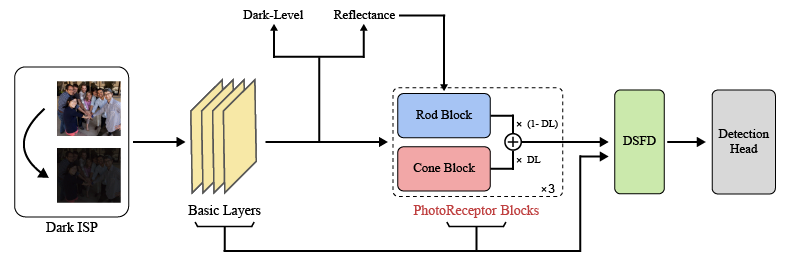

<p align="center">
  <h1 align="center">Darkness Adaptive Activation: Object Detection with Zero-Shot Domain Adaptation</h1>
  <p align="center">
    <a>Chanhee Lee<sup>1</sup></a>
    ·
    <a>Byungho Ko<sup>2</sup></a>
    ·
    <a>Yeonhoo Jung<sup>2</sup></a>
    ·
    <a>Jinwoong Jung<sup>2</sup></a>
  </p>
  <p align="center">
    <i>Sungkyunkwan University · Department of Applied Artificial Intelligence</i><br>
    <i>2025-1 Undergraduate Research Program (URP)</i>
  </p>
</p>


## :sparkles: Bio-Receptor Network (BRNet)


## 📄 [Paper](https://drive.google.com/file/d/121UTjugoAJgbZUPCxr5GYTC4QmHdAWBZ/view?usp=sharing)

### 🖼️ Model Overview


## 🚧 Experiment Not Conducted  
Although the model architecture is implemented, **full-scale experiments have not been conducted due to limited computational resources**.  
This repository currently focuses on the model structure and core ideas; training and evaluation scripts are included for reference but not yet tested end-to-end.

## :wrench: Installation

Begin by cloning the repository and setting up the environment:

```
git clone https://github.com/iontail/BRNet.git
cd BRNet

conda create -y -n brnet python=3.8
conda activate brnet

pip install torch==1.13.1 torchvision==0.14.1 -f https://download.pytorch.org/whl/torch_stable.html

pip install -r requirements.txt
```


## :computer: Training

#### Data and Weight Preparation

- Download the WIDER Face Training & Validation images at [WIDER FACE](http://shuoyang1213.me/WIDERFACE/).
- Obtain the annotations of [training set](https://github.com/daooshee/HLA-Face-Code/blob/main/train_code/dataset/wider_face_train.txt) and [validation set](https://github.com/daooshee/HLA-Face-Code/blob/main/train_code/dataset/wider_face_val.txt).
- Download the [pretrained weight](https://drive.google.com/file/d/1MaRK-VZmjBvkm79E1G77vFccb_9GWrfG/view?usp=drive_link) of Retinex Decomposition Net.


Organize the folders as:

```
.
├── utils
├── weights
│   ├── decomp.pth
├── dataset
│   ├── wider_face_train.txt
│   ├── wider_face_val.txt
│   ├── WiderFace
│   │   ├── WIDER_train
│   │   └── WIDER_val
```


## Acknowledgement

We thank [DAI-Net.Pytorch](https://github.com/ZPDu/DAI-Net.git), [DSFD.pytorch](https://github.com/yxlijun/DSFD.pytorch), [RetinexNet.PyTorch](https://github.com/aasharma90/RetinexNet_PyTorch), [InterImage.Pytorch](https://github.com/OpenGVLab/InternImage/tree/master/detection/ops_dcnv3) for their amazing works!

We mainly referenced the pytorch implementation of [DAI-Net](https://github.com/ZPDu/DAI-Net.git)! 

